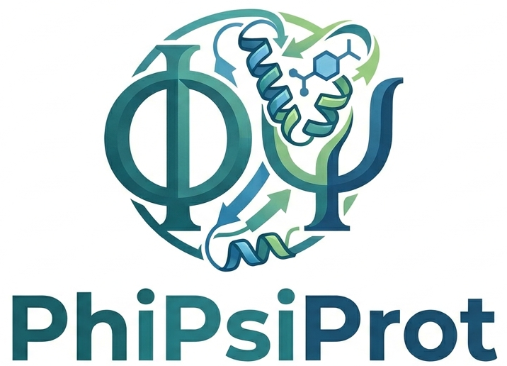
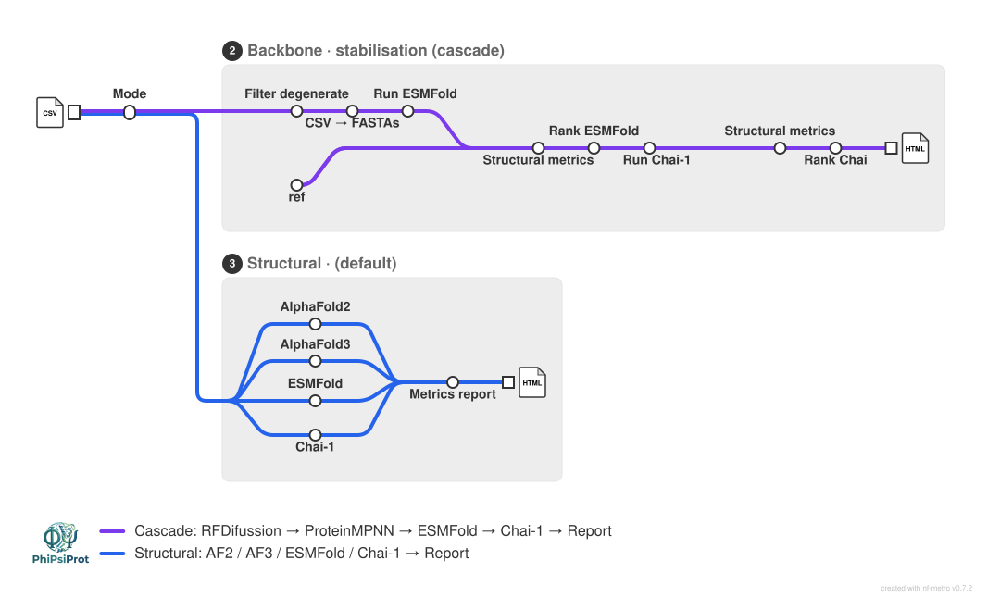

# PhiPsiProt

<picture>
  <source media="(prefers-color-scheme: dark)" srcset="docs/images/nf-core-proteinfold_logo_dark.png">
  
</picture>

[](https://www.nextflow.io/)
[](https://www.docker.com/)
[](https://sylabs.io/docs/)

**PhiPsiProt** is a Nextflow DSL2 pipeline for protein structure prediction, computational drug design, and de novo antibody design, developed at the Bioengineering and Biomedical Computing Unit of the [Centro de Investigación Biomédica de La Rioja (CIBIR) ](https://www.cibir.es/es/). It extends [nf-core/proteinfold](https://nf-co.re/proteinfold) with five operational modes covering the full cycle from structure prediction to candidate prioritisation.

---

## Pipeline overview



The pipeline exposes five modes via `--mode`:

| Mode | Use case |
|---|---|
| `structural` | Multi-tool structure prediction and comparison |
| `backbone` | Backbone stabilisation: ESMFold → Chai-1 with structural metrics and YAML-configurable ranking |
| `screening` | Saturation mutagenesis + structural validation of mutant candidates |
| `peptide_design` | Peptide binder design (stub, in development) |
| `antibody_design` | De novo VHH / scFv design: RFdiffusion → ProteinMPNN → ESMFold2 → AF3 → HADDOCK3 |

All modes support an optional intermediate ligand/binder docking step (`--ligand true`) using GNINA and Boltz-2 co-folding before final structural validation.

---

## Modes

### `structural` (default)

Runs one or more structure prediction tools in parallel on a samplesheet of protein sequences. Supported tools (selectable via `--structural_tools`): AlphaFold2, AlphaFold3, ESMFold, Chai-1, ColabFold, RoseTTAFold2NA, RoseTTAFold-All-Atom, HelixFold3, Boltz.

Each tool produces a predicted structure, pLDDT, PAE and pTM metrics. Results are combined in an interactive HTML report with NGL viewer and Plotly charts.

```bash
nextflow run main.nf -profile docker \
  --mode structural \
  --structural_tools AF3,ESM,Chai \
  --input samplesheet.csv \
  --alphafold3_db /mnt/alphafold3_db/ \
  --outdir results/
```

### `backbone`

Two-stage screening for backbone stabilisation of protein variants. Designed for campaigns where a large number of point mutants or designed sequences need to be rapidly triaged before expensive structural validation.

**Pipeline:** Filter degenerate sequences → CSV → FASTAs → ESMFold (fast) → structural metrics + YAML ranking → top N → Chai-1 (accurate) → structural metrics + YAML ranking → HTML report

Metrics computed at each stage: Rosetta ΔG, ΔΔG vs reference, TM-score, mean pLDDT, SAP score (aggregation propensity), ΔSAP, net charge, number of cysteines. All scoring weights and gate thresholds are configurable via a YAML file (`--scoring_config`).

```bash
nextflow run main.nf -profile docker \
  --mode cascade \
  --input samplesheet.csv \
  --scoring_config conf/scoring_config_structural.yaml \
  --outdir results/
```

### `screening`

Saturation mutagenesis at user-defined positions of a reference PDB. Generates all single amino acid substitutions at the specified positions, then runs the full structural validation cascade to rank them.

```bash
nextflow run main.nf -profile docker \
  --mode screening \
  --input_pdb reference.pdb \
  --target_chain A \
  --positions "5,10,42,67" \
  --outdir results/
```

### `antibody_design`

De novo antibody design implementing the Watson et al. (Nature 2026) pipeline with extensions. Supports VHH (nanobodies, single domain) and scFv (conventional antibody fragments).

**Pipeline:**

```
RFdiffusion (rfantibody fine-tuned)
    ↓  N backbone designs
ProteinMPNN (rfantibody wrapper)
    ↓  N × seqs_per_struct sequences
ESMFold2-Fast (Biohub)          ← pre-filter, model loaded once for all designs
    ↓  top 20%  (ipTM H↔T, PAE interface, pLDDT CDR, RMSD CDR)
AlphaFold3
    ↓  top 10   (ipTM ≥ 0.60 VHH / ≥ 0.85 scFv)
HADDOCK3 docking
    ↓  top 10   (HADDOCK score, buried SASA, van der Waals energy)
HTML report (ESMFold2 | AF3 | HADDOCK3 tabs, NGL viewer)
```

All filter thresholds and ranking weights are configurable via YAML files (one per stage). The ESMFold2 pre-filter runs the entire batch in a single process to load the ESMC-6B backbone only once and avoid GPU OOM.

```bash
nextflow run main.nf -profile docker \
  --mode antibody_design \
  --ab_type VHH \
  --ab_target_pdb antigen_truncated.pdb \
  --ab_framework_pdb h-NbBCII10.pdb \
  --ab_hotspot_residues "B131,B132,B133,B156,B157,B158" \
  --ab_design_loops "H1:7,H2:6,H3:5-13" \
  --ab_rfdiff_weights /mnt/alphafold3_db/RFD/RFdiffusion_Ab.pt \
  --ab_mpnn_weights /mnt/alphafold3_db/RFD/ProteinMPNN_v48_noise_0.2.pt \
  --ab_esmfold2_weights /mnt/alphafold3_db/ESMFold2/hub \
  --ab_num_designs 1000 \
  --ab_seqs_per_struct 4 \
  --alphafold3_db /mnt/alphafold3_db/ \
  --ab_scoring_esm conf/scoring_ab_esmfold2.yaml \
  --ab_scoring_af3 conf/scoring_ab_af3.yaml \
  --ab_scoring_haddock3 conf/scoring_ab_haddock3.yaml \
  --outdir results/
```

**Key parameters:**

| Parameter | Description | Default |
|---|---|---|
| `--ab_type` | `VHH` or `scFv` | `VHH` |
| `--ab_antigen_chain` | Chain ID of antigen in target PDB | `B` |
| `--ab_hotspot_residues` | Epitope residues e.g. `B131,B132` (chain letter + resnum of original PDB, **not** T) | required |
| `--ab_design_loops` | CDR loops and lengths e.g. `H1:7,H2:6,H3:5-13` | required |
| `--ab_num_designs` | Number of RFdiffusion backbone designs | `50` |
| `--ab_seqs_per_struct` | ProteinMPNN sequences per backbone | `4` |
| `--ab_mpnn_temperature` | ProteinMPNN sampling temperature | `0.2` |
| `--ab_af3_seeds` | AF3 seeds per design (max ipTM taken) | `10` |
| `--ab_run_haddock` | Run HADDOCK3 docking stage | `true` |
| `--ab_iptm_threshold` | Legacy single-threshold param (use YAML gates instead) | `0.60` |

**YAML scoring files** (`assets/scoring/`):

- `scoring_ab_esmfold2.yaml` — gates (pLDDT CDR, PAE interface, RMSD CDR, ipTM H↔T), top 20%
- `scoring_ab_af3.yaml` — gates (ipTM, PAE global), top 10
- `scoring_ab_haddock3.yaml` — gates (HADDOCK score), top 10

Each YAML supports `normalization` (zscore/minmax), hard `gates`, metric `directions` (higher/lower), `weights`, and either `top_n` or `top_pct` cutoff.

### Ligand/binder docking filter (`--ligand true`)

An optional intermediate docking/co-folding step that can be inserted into any mode before final structural validation. Designed for scoring small-molecule inhibitors or peptide binders against a receptor.

**Sub-pipeline:**

```
Candidate CSV
    ↓
ESMFold (rapid monomer folding of candidates)
    ↓
GNINA (CNN-based docking, N replicates per candidate)
    → CNN score, CNN affinity, affinity (kcal/mol), Mann-Whitney U vs reference
    ↓
Boltz-2 co-folding + affinity prediction
    → confidence score, predicted affinity
    ↓
HADDOCK3 (optional, --docking_tool haddock3)
    → HADDOCK score, AIRs from pocket residues
    ↓
Top candidates → structural validation (AF3, Chai-1, etc.)
```

**GNINA** runs N replicates (`--ligand_filter_runs`, default 3) per candidate, extracts CNN score, CNN affinity and binding affinity for the best pose, and produces a PDF with score distributions and Mann-Whitney U tests vs the original reference compound.

**Boltz-2** co-folds the receptor + ligand/peptide together and provides a confidence score and predicted binding affinity. The top candidates from Boltz-2 are passed to the co-fold samplesheet for full structural prediction.

```bash
nextflow run main.nf -profile docker \
  --mode structural \
  --structural_tools AF3 \
  --input samplesheet.csv \
  --ligand true \
  --docking_tool gnina \
  --ligand_candidates_csv candidates.csv \
  --ligand_reference_pdb 3KS3.pdb \
  --ligand_resname GOL \
  --pocket_residues "A5,A4,A10,A238,A239,A240,A241,A242,A243,A100" \
  --ligand_filter_runs 3 \
  --gnina_box_size 20 \
  --gnina_exhaustiveness 8 \
  --receptor_sequence receptor.fa \
  --ligand_ccd GOL \
  --boltz_model boltz2 \
  --outdir results/
```

**Ligand filter parameters:**

| Parameter | Description | Default |
|---|---|---|
| `--ligand` | Enable intermediate docking filter | `false` |
| `--docking_tool` | `gnina`, `haddock3`, or `rosettadock` | `gnina` |
| `--ligand_candidates_csv` | CSV with `candidate_id,pdb` columns | required |
| `--ligand_reference_pdb` | Reference receptor PDB for box definition and baseline scores | required |
| `--ligand_file` | Ligand file for GNINA (extracted from reference if omitted) | optional |
| `--ligand_resname` | Residue name to extract as ligand | `GOL` |
| `--ligand_ccd` | CCD code for Boltz-2 ligand co-folding | optional |
| `--ligand_smiles` | SMILES string for Boltz-2 ligand co-folding | optional |
| `--pocket_residues` | Comma-separated pocket residues for GNINA box and HADDOCK AIRs | required |
| `--ligand_filter_runs` | GNINA/Boltz-2 replicates per candidate | `3` |
| `--gnina_box_size` | GNINA cubic box size (Å) | `20` |
| `--gnina_exhaustiveness` | GNINA exhaustiveness | `8` |
| `--gnina_num_modes` | Docking poses requested from GNINA | `9` |
| `--receptor_sequence` | Receptor FASTA for Boltz-2 co-folding | required with `--ligand` |

---

## Samplesheet format

```csv
id,fasta
candidate_001,candidate_001.fasta
candidate_002,candidate_002.fasta
```

For ligand docking, the candidates CSV format is:

```csv
candidate_id,pdb
compound_A,compound_A.pdb
compound_B,compound_B.pdb
```

---

## Outputs

Each mode writes to `--outdir` with the following structure:

```
outdir/
├── antibody_design/
│   ├── 01_rfdiffusion/          *.qv Quiver files
│   ├── 02_proteinmpnn/          *.qv Quiver files
│   ├── 03_af3_inputs/           *.json AlphaFold3 input JSONs
│   ├── 04_esmfold2/             *_esm2_metrics.tsv, *_esm2_pred.cif
│   ├── 05_af3/                  *_iptm.tsv, *_alphafold3.cif
│   ├── 06_haddock3/             *_haddock_metrics.tsv
│   └── rankings/                *_ranked.tsv (ESMFold2, AF3, HADDOCK3)
│   └── PhiPsiProt_antibody_report.html
├── structural/                  per-tool subdirectories
├── cascade/                     ESMFold and Chai-1 results + report
├── ligand_docking/              gnina_scores.tsv, gnina_summary.tsv, *.sdf, *.pdf
└── pipeline_info/               execution timeline, resource usage
```

---

## Requirements

- Nextflow ≥ 25.10.2
- Docker or Singularity
- GPU strongly recommended (RTX5000-Ada 16GB or equivalent tested)

**Model weights required** (not downloaded automatically):

| Model | Path | Size |
|---|---|---|
| RFdiffusion antibody | `RFD/RFdiffusion_Ab.pt` | ~500 MB |
| ProteinMPNN | `RFD/ProteinMPNN_v48_noise_0.2.pt` | ~30 MB |
| ESMFold2-Fast | `ESMFold2/hub/models--biohub--ESMFold2-Fast/` | ~3 GB |
| ESMC-6B (backbone) | `ESMFold2/hub/models--biohub--ESMC-6B/` | ~12 GB |
| ESMFold2 CCD dict | `ESMFold2/hub/models--biohub--ESMFold2/` | ~400 MB |
| AlphaFold3 | `/mnt/alphafold3_db/` | ~1.2 TB |

---

## Installation

```bash
git clone https://github.com/riojasalud/PhiPsiProt.git
cd PhiPsiProt

# Test with stub mode (no weights needed)
nextflow run main.nf -profile docker -stub \
  --mode antibody_design \
  --outdir results_stub/
```

---

## Credits

PhiPsiProt was developed at the **Unidad de Ingeniería y Computación Biomédica, CIBIR ** based on [nf-core/proteinfold](https://nf-co.re/proteinfold).

**Authors:**

- Paula de Blas Rioja — pblas@riojasalud.es
- Laura González López — lgonlopez@riojasalud.es
- álvaro Pérez Sala Pérez — aperez@riojasalud.es

The antibody design module implements the computational pipeline described in:

> Watson JL et al. *De novo design of protein structure and function with RFdiffusion.* Nature (2023). doi: 10.1038/s41586-023-06415-8

> Watson JL et al. *Broadly applicable and accurate protein–protein complex prediction using ESMFold2.* Nature (2026).

GNINA docking: McNutt AT et al. *GNINA 1.0: molecular docking with deep learning.* J Cheminformatics (2021).

Boltz-2: Wohlwend J et al. *Boltz-2: Towards accurate and efficient biomolecular co-folding.* bioRxiv (2025).

---

## Citation

If you use PhiPsiProt in your research, please cite:

> Blanco Sáez P, López González G, Pérez A. *PhiPsiProt: a Nextflow pipeline for protein structure prediction and computational antibody design.* Hospital Universitario de La Rioja (2026).

And the underlying nf-core framework:

> Ewels P et al. *The nf-core framework for community-curated bioinformatics pipelines.* Nat Biotechnol (2020). doi: 10.1038/s41587-020-0439-x
